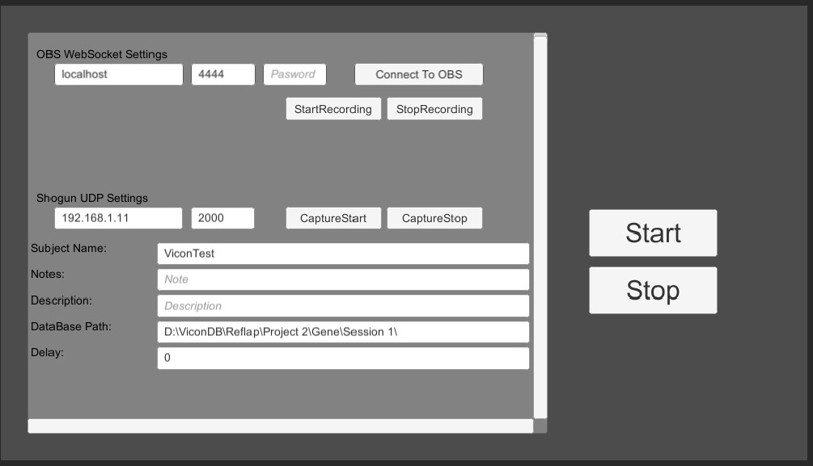
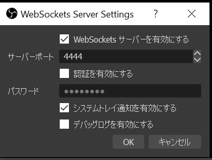

# tool_Vicon-OBS-Control

ViconとOBSをネットワーク制御し、同時に録画スタート／ストップする Unityで作っているが、TouchDesignerにしたい

## MadeWithUnity

- OBS WebSocket Setting
  - OBSが動いているPCのIP、ポートを設定する
  - 必要ならパスワードも
  - 【Connect To OBS】を押して、OBSと接続
- 【StartRecording】 / 【StopRecording】で、録画できるかテスト
  - 録画した動画の保存先はOBSで設定

- Shogun(Vicon) UDP Settings
  - IP/Protを設定
  - SubjectName 何のキャプチャデータか？Shogunには、日時付きで送られる
  - DataBasePath ShogunPC上でのデータベースのフォルダパスを入力
  - 【CaptureStart】 / 【CaptureStop】で、キャプチャできるかテスト
  - <https://docs.vicon.com/pages/viewpage.action?pageId=71241697>

  【Start】 / 【Stop】ボタンで、OBS,Shogunに同時に信号を送る

### OBS Websocket Setting

- OBS-WebSocket のプラグインを導入
  - <https://github.com/Palakis/obs-websocket/releases>

「ツール」→「WebSocket Server Settings」で、WebSocketサーバーの設定をする